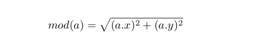
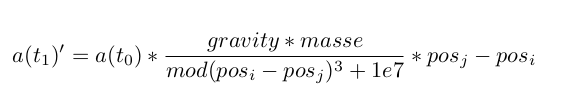
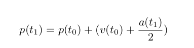
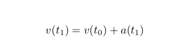

<!-- ENAYATI Yas et SATCHIVI Ashley -->

# IMPLEMENTATION DES FONCTIONS MANQUANTES

## Fonctions basiques
1. add_vectors 
    Signature de la fonction : vector add_vectors (vector a, vector b)
        *   Objectif : 
                cette fonction additionne deux vecturs 
        *   Notes :
                Cette fonction prend 2 vecteurs "a" et "b" et retourne un vecteur. 
                La fonction associe à l'abscisse du vecteur retourné, la somme des abcisses de "a" et "b", et associe la somme des ordonnées de "a" et "b" à l'ordonnée du vecteur retournée.     

2. sub_vectors
    Signature de la fonction : vector sub_vectors (vector a, vector b)
    *   Objectif : cette fonction fait la soustraction de deux vecteurs
    *   Notes :
            Cette fonction prend 2 vecteurs "a" et "b" et retourne un vecteur. 
            La fonction associe :
                - à l'abscisse du vecteur retourné, l'abcisse de "a" moins l'abcisse de "b". 
                - à l'ordonnée du vecteur retourné, l'ordonnée de "a" moins l'ordonnée de "b".   

3. mod 
    Signature de la fonction : f64 mod (vector a)

    *   Objectif : cette fonction calcule la distance euclidienne d'un vecteur

    

    *   Notes : 
            Cette fonction prend un vecteur "a" et retourne un nombre de type double qui est la racine carrée de la somme des carrés de l'abcisse et de l'ordonnée.

4. Scale_vector 
    Signature de la fonction : vector scale_vector (f64 b, vector a)
    *   Objectif :
            cette fonction multiplie un vecteur avec un nombre réel 
    *   Notes :
            Cette fonction prend 1 vecteurs "a", un réel "b" et retourne un vecteur. 
            La fonction associe :
                - à l'abscisse du vecteur retourné, l'abcisse de "a" fois "b". 
                - à l'ordonnée du vecteur retourné, l'ordonnée de "a" fois "b".      

## Fonctions de simulation 

1. compute_accelerations
    Signature de la fonction : void compute_accelerations (i32 nbodies, vector *accelerations, f64 *masses, vector *positions)

    *   objectif : cette fonction permet de calculer l'accélération d'une particule  

    

    *   Notes : 
            Cette fonction calcule l'accélération subie par chaque corps sous l'effet de la gravité exercée par les autres corps.
            On a 2 variables i et j qui parcourent le nombre de particules.
            *   Pour chaque corps i :
                    on initialise son accélération à 0
            *   Pour chaque corps j :
                    - on calcule le vecteur distance entre "i" et "j"
                    - on calcule l'intensité de la force gravitationnelle
                    - on transforme cette force en accélération vectorielle
                    - on l'ajoute à l'accélération totale de "i"
    

2. compute_positions
    Signature de la fonction : void compute_positions (i32 nbodies, vector *positions, vector *velocities, vector *accelerations)
    *   objectif : 
        La fonction compute_positions calcule la position de la particule en fonction de sa vitesse et de sa position à t-1.

    

    * Notes : 
        on parcourt le nombre de particules et pour chaque particules, on calcule sa position par rapport à la vitesse et sa position.
        A la fin, on vérifie la position de la particule avec la fonction check_position 

3. compute_velocities 
    Signature de la fonction : void compute_velocities (i32 nbodies, vector *velocities, vector *accelerations)
    *   objectif : 
            La fonction compute_velocities permet de calculer la vélocité (vitesse) de chaque particule pour chaque pas de temps.

    

    *   Notes : 
            Pour chaque particules, la nouvelle vitesse de la particule est égale à l'ancienne vitesse de la particule + l'accélération de la particule 

4. resolve_collision 
    Signature de la fonction : void resolve_collisions (i32 nbodies, vector *positions, vector *velocities)
    *   objectif : 
            Elle échange la vitesse de 2 particules qui rentrent en collision
    *   Notes : 
            2 particules sont en collision quand elles ont la position
            On a 2 variables i et j qui parcourent le nombre de particules.
            i prend en compte une particule et j toutes les autres particules 
            Quand deux particules différentes (i!=j) rentrent en collision (position[i] == position[j]), on affecte la vitesse de la particule "i" à la particule "j" et inversement.

5. check position
    Signature de la fonction : vector check_position (vector a)
    *   objectif : cette fonction permet au particules qui sortent de la fenêtre de rentrer par le coté opposé.
    *   Note : 
        * Si la particule sort par la droite (a.x>= DIM_WINDOW), on le fait rentrer par la gauche ( a.x = 0) et inversement 
        * Si la particule sort par le bas ( a.y>= DIM_WINDOW), on le fait rentrer par le haut (a.y = 0) et inversement

# OPTIMISATION DU CODE 

# PERFORMANCES 

